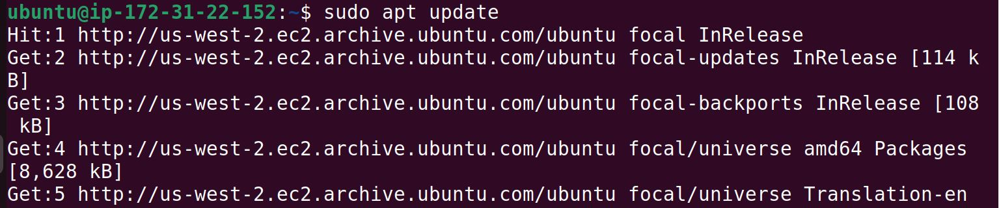
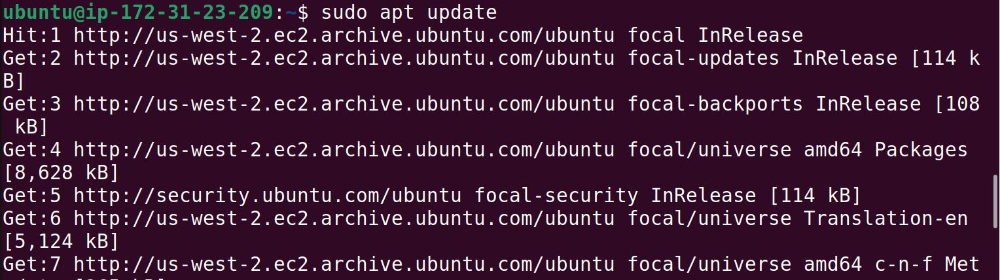
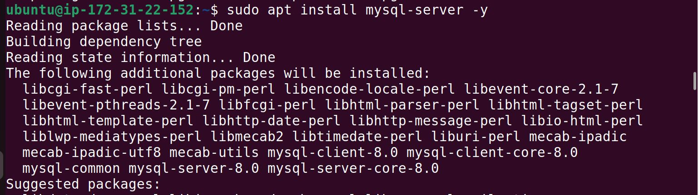
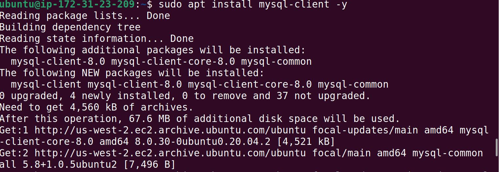
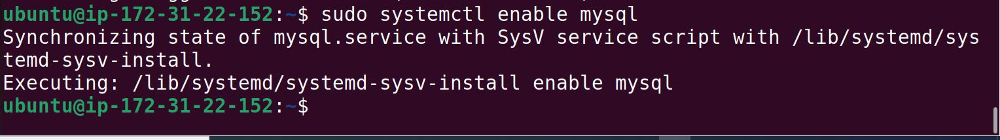
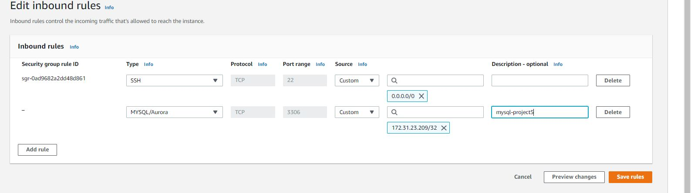
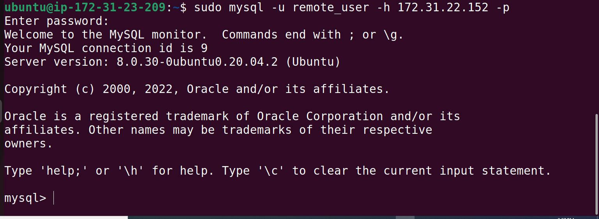

	# PROJECT 5

	**In this project, i am to "IMPLEMENT A CLIENT SERVER ARCHITECTURE USING MYSQL DATABASE MANAGEMENT SYSTEM (DBMSt)" **

 `I followed the video to implement this project`
 
 `First i created two servers using my Ec2 on my AWS accout`

 `I connected using ssh key and did sudo apt updtae for both servers`

 `I installed mysql on both servers for mysql-client and  mysql-server`

 `I enabled mysql`

`I edited my inbound rule on my server and set port to receive for my client server`

 

 `I connected to mysql using my client after granting and priviledges to my client server`

 

 git

